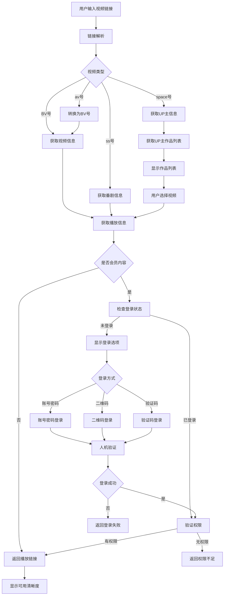
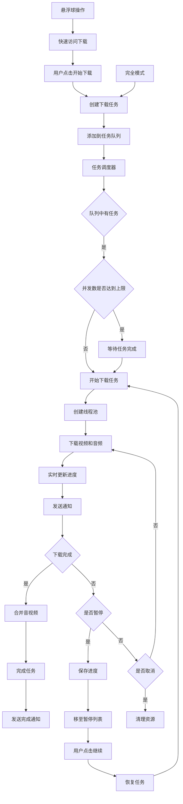
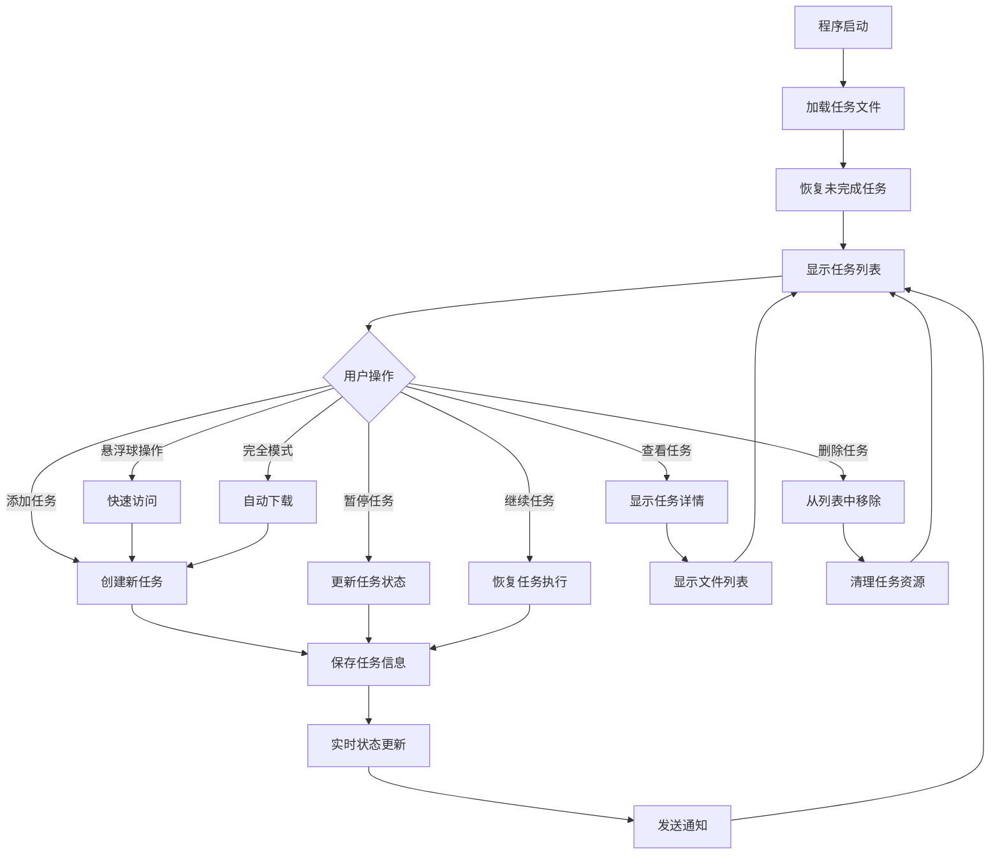

<div align="center">
<h1>B站视频解析下载工具</h1>
<p>一款功能强大的B站视频解析与下载工具，支持多种视频类型和下载模式，为用户提供便捷的视频内容获取体验。</p>
<div>
<a href="https://github.com/NANblogink/bilibilidownloadtool/issues" target="_blank">

</a>
<a href="https://github.com/NANblogink/bilibilidownloadtool/stargazers" target="_blank">

</a>
<a href="https://github.com/NANblogink/bilibilidownloadtool/forks" target="_blank">
</a>
<a href="https://github.com/NANblogink/bilibilidownloadtool/actions" target="_blank">

</a>
<a href="#" target="_blank">
</a>
</div>
</div>

## 功能特性

- **多格式支持**：兼容BV号、ss号、av号等多种链接格式
- **丰富的内容类型**：支持番剧、合集、课堂、充电等多种视频类型
- **灵活的清晰度选择**：提供多种画质选项，满足不同场景需求
- **批量下载能力**：支持多集视频同时下载，提高效率
- **会员内容访问**：通过Cookie登录，可下载会员专属内容
- **智能资源管理**：取消下载时自动清理临时文件，节省存储空间
- **直观的用户界面**：简洁美观的界面设计，操作流程清晰易懂
- **实时任务管理**：任务列表实时更新，保持滚动位置和选中状态
- **后台运行能力**：下载窗口关闭后任务在后台继续执行
- **详细的任务控制**：支持查看任务详情、停止操作等功能
- **高效的文件管理**：任务详细窗口支持文件列表搜索筛选
- **便捷的操作方式**：文件列表支持右键菜单，提供快捷操作
- **实时状态更新**：所有任务状态实时获取和展示
- **独立任务控制**：任务间相互独立，支持单独暂停/继续操作
- **任务恢复能力**：删除任务后重新添加可正常开始下载
- **多种登录方式**：支持账号密码、二维码、验证码等多种登录方式
- **悬浮球工具栏**：可拖动的悬浮球，支持快速访问下载功能
- **实时通知系统**：下载状态和系统消息的实时通知提醒
- **人机验证支持**：集成极验验证码，解决登录和访问限制问题
- **界面自适应**：优化界面布局，支持不同屏幕尺寸
- **实时下载进度**：单个视频的实时进度跟踪和状态显示
- **UP主主页解析**：支持解析UP主主页，显示作品列表并选择下载
- **多选解析功能**：支持在UP主作品列表中选择多个视频进行批量解析
- **完全模式**：自动全选集数并下载，一键完成所有操作
- **下载速度控制**：可选择是否显示下载速度信息
- **下载完成操作**：可配置下载完成后自动打开文件夹或播放提示音

## 项目架构

| 文件/目录名称 | 功能描述 |
|------------|----------|
| `main.py` | 主程序入口，负责应用初始化和主窗口启动 |
| `ui.py` | 主界面实现，包含主窗口、任务管理窗口、批量下载窗口和悬浮球 |
| `ui.ui` | Qt Designer生成的UI设计文件（后续版本不再更新） |
| `downloader.py` | 下载管理器，负责任务调度和执行 |
| `bilibili_parser.py` | B站视频解析器，负责链接解析和播放信息获取 |
| `task_manager.py` | 任务管理器，负责任务信息的保存和管理 |
| `config.py` | 配置管理，负责应用配置的加载和管理 |
| `utils.py` | 工具函数库，提供各种辅助功能 |
| `wbi_sign.py` | WBI签名生成器，用于访问B站API |
| `env_checker.py` | 环境检查工具，确保系统环境满足运行要求 |
| `error_codes.py` | 错误码定义，统一错误处理 |
| `api_request.py` | API请求封装，处理网络请求和响应 |
| `video_parser.py` | 视频解析工具，处理视频信息解析 |
| `clean_temp.py` | 临时文件清理工具 |
| `app_config.json` | 应用配置文件 |
| `version_info.json` | 版本信息文件 |
| `version_info.txt` | 版本信息文本文件 |
| `logo.ico` | 应用图标文件 |
| `logo.png` | 应用Logo图片 |
| `pyproject.toml` | 项目依赖管理文件 |
| `.gitignore` | Git忽略文件配置 |
| `LICENSE` | 项目许可证文件 |
| `bento4/` | Bento4 SDK，用于DRM解密 |
| `ffmpeg/` | FFmpeg工具，用于音视频合并 |

## 快速开始

### 环境准备
- Python 3.7 或更高版本
- PyQt5 库
- requests 库

### 安装依赖
```bash
pip install PyQt5 requests
```

### 启动程序
```bash
python main.py
```

### 使用流程
1. 在"视频链接"输入框中粘贴B站视频链接
2. 点击"解析链接"按钮获取视频信息
3. 选择需要下载的集数（番剧或合集）
4. 选择合适的视频清晰度
5. 选择保存路径
6. 点击"开始下载"按钮启动任务

### 完全模式使用
1. 勾选"完全模式（自动全选集数并下载）"复选框
2. 解析视频链接
3. 选择想要的分辨率
4. 解析成功后会自动全选所有集数并开始下载

### UP主主页解析
1. 在"视频链接"输入框中粘贴UP主主页链接（如：https://space.bilibili.com/12345678）
2. 点击"解析链接"按钮
3. 在弹出的作品列表对话框中选择需要下载的视频
4. 可勾选"完全模式"自动下载所有视频
5. 点击"解析选中"或"下载全部"按钮开始下载

### Cookie设置
- 如需下载会员专属内容，可在"Cookie设置"区域输入B站Cookie
- Cookie获取方法：浏览器登录B站后，打开开发者工具复制Cookie字符串
- 点击"验证并保存"按钮，程序会自动验证Cookie有效性
- 课堂/充电等特殊类型视频需要账号具备对应权限

## 常见问题

### Q: 解析失败如何处理？
A: 请检查链接格式是否正确，确保为有效的B站视频链接。部分番剧内容可能需要登录后才能解析。

### Q: 下载失败如何解决？
A: 检查网络连接状态，确保保存路径有写入权限。会员内容请确认Cookie是否有效。

### Q: 下载的视频没有声音怎么办？
A: 这是正常现象，程序会在下载完成后自动合并视频和音频轨道。

### Q: HEVC编码有什么优势？
A: HEVC是一种高效的视频编码格式，可在相同画质下减小文件体积，或在相同文件大小下提升画质。

### Q: 完全模式如何使用？
A: 勾选"完全模式"复选框后，解析视频会自动全选所有集数并开始下载，无需手动选择集数。

### Q: 如何解析UP主主页？
A: 输入UP主主页链接（如：https://space.bilibili.com/3546841002019157），点击解析，会弹出作品列表供选择。

## 免责声明

- **使用范围**：本工具仅用于个人学习和研究目的，严禁用于任何商业用途
- **合规要求**：请严格遵守B站用户协议和相关法律法规，避免下载版权受限内容
- **责任归属**：使用本工具产生的任何法律责任由使用者自行承担，作者不承担连带责任
- **资源使用**：下载视频时请注意网络带宽和存储空间，避免对服务器造成过度负担
- **风险提示**：本工具仅供学习参考，使用者应自行评估并承担使用风险
- **问题反馈**：如遇技术问题，请检查日志文件获取详细信息，或联系作者寻求帮助

## 联系我们

- 作者：寒烟似雪 / 逸雨
- QQ：2273962061 / 3241417097
- 哔哩哔哩：不会玩python的man
- 个人主页：https://space.bilibili.com/3546841002019157

## 版本历史
### 2026年4月18日07:20:11 维护
- **收藏增加骨架屏，修复收藏获取不全问题**：现在几百的收藏也可以获取了
- **在缺少扩展时提示下载**:我将hevc扩展放在目录下hevc安装.appx，可以直接运行，程序内也支持安装
- **字幕解析研究中**：字幕解析不能工作，因为我还没有研究出auth_key的获取方式
- **尝试适配win7**:有朋友反应win7报错，我看了是有个高性能库在win7用不了，我会在不能使用它的情况下使用标准库，希望可以解决win7报错的问题（再不行我要搞命令行了）

### V1.9.0 修复版
- **修复文件选择功能**：现在文件选择窗口可以正常弹出
- **合并窗口可选弹出**：有朋友反应多视频合并会频繁弹出，现在默认不弹出，可以在设置选择启用。

### v1.9.0
- **添加解析进度显示**：在解析过程中显示视频信息和进度条
- **添加合并进度显示**：在合并过程中显示合并进度条
- **修复已知问题**：增强稳定性，解决各种边界情况

### v1.8.0
- **完全模式**：自动全选集数并下载，一键完成所有操作
- **UP主主页解析**：支持解析UP主主页，显示作品列表并选择下载
- **支持收藏解析**: 现在可以解析你账号里面收藏的内容了
- **输出格式增加**：输出的格式不仅仅是mp4，还支持更多的视频格式输出
- **更新了版本号**：现在版本号是v1.8.0了
- **新增主页显示**：登录后点击右上角的用户名看看吧！

### v1.7.0
- **课程视频支持**：大部分课程视频现在可以正常下载
- **弹幕解析功能**：新增弹幕解析和下载能力
- **修复已知问题**：增强稳定性，解决各种边界情况

### v1.6.0
- **新增账号密码、二维码、验证码多种登录方式**：提供多种登录选项，方便用户获取会员权限
- **悬浮球工具栏**：添加可拖动的悬浮球，支持快速访问下载功能
- **实时通知系统**：下载状态和系统消息的实时通知提醒
- **人机验证支持**：集成极验验证码，解决登录和访问限制问题
- **界面全面优化**：提升自适应能力，支持不同屏幕尺寸
- **下载进度优化**：实时显示下载进度和状态，支持单个视频进度跟踪
- **修复已知问题**：增强稳定性，解决各种边界情况

### v1.5.0
- 新增课堂视频解析功能（同类工具中较为少见）
- 实现下载暂停/删除功能
- 优化界面设计，采用自定义边框
- 添加退出确认机制

### v1.4.0
- 支持批量下载多个视频
- 新增充电视频解析能力
- 修复进度条显示异常问题
- 优化任务管理显示逻辑
- 改进任务交互机制
- 完善程序退出处理流程

### v1.3.0
- 优化任务列表刷新机制，保持滚动位置和选中状态
- 调整下载窗口关闭行为，支持后台运行
- 为下载中任务添加"查看下载"和"停止下载"功能
- 优化任务详细窗口，支持文件列表搜索筛选
- 添加文件列表右键菜单功能
- 确保所有状态实时更新
- 优化代码结构，提升性能

### v1.2.0
- 实现任务状态实时更新
- 添加任务详情窗口，支持查看下载文件列表
- 实现文件存在检测，支持打开文件和重新下载
- 优化任务管理界面，提升用户体验

### v1.1.0
- 添加线程数选择功能
- 新增环境检查工具
- 修复下载完成后闪退问题
- 优化Cookie验证和管理功能

### v1.0.0
- 初始版本，实现基本的视频解析和下载功能
- 支持番剧和合集视频
- 提供多种清晰度选择
- 支持批量下载
- 实现Cookie登录
- 支持HEVC编码视频

## 技术实现

### 视频解析流程



### 解析原理

1. **链接解析**：通过正则表达式从URL中提取视频ID（BV号、ss号、av号或space号）
2. **API调用**：根据视频类型调用对应B站API获取详细信息
3. **WBI签名**：使用正确的WBI签名计算方法访问B站API
4. **播放信息获取**：通过专用方法获取视频播放链接和可用清晰度
5. **权限验证**：检查用户是否有权限访问会员内容，验证登录状态
6. **登录处理**：支持账号密码、二维码、验证码等多种登录方式
7. **人机验证**：集成极验验证码，解决登录和访问限制问题
8. **UP主主页解析**：使用`x/space/wbi/arc/search` API获取UP主作品列表

### 下载管理流程



### 下载管理机制

1. **任务调度**：使用`ThreadPoolExecutor`管理下载线程，支持并发执行
2. **断点续传**：通过检查临时文件大小和设置`Range`请求头实现
3. **状态管理**：通过专用字典管理不同状态的任务
4. **进度跟踪**：实时记录下载进度，通过信号机制更新UI
5. **实时通知**：下载状态变化时发送通知提醒
6. **悬浮球集成**：支持通过悬浮球快速访问下载功能
7. **完全模式**：自动全选集数并开始下载

### 任务管理流程



### 任务管理系统

1. **任务存储**：使用`download_tasks.json`文件持久化存储任务信息
2. **状态更新**：任务状态变化时实时同步到存储文件
3. **任务恢复**：程序启动时自动恢复未完成的任务
4. **任务清理**：定期清理已完成任务，保持列表整洁
5. **实时状态**：所有任务状态实时获取和展示
6. **通知集成**：任务状态变化时发送通知提醒

### 界面交互实现

1. **PyQt5界面**：使用PyQt5构建现代化用户界面
2. **信号槽机制**：通过Qt信号槽实现组件间通信
3. **多窗口管理**：支持主窗口、任务管理窗口和批量下载窗口
4. **实时更新**：下载进度和任务状态实时反映到界面
5. **悬浮球工具栏**：可拖动的悬浮球，支持快速访问下载功能
6. **实时通知系统**：下载状态和系统消息的实时通知提醒
7. **界面自适应**：优化界面布局，支持不同屏幕尺寸
8. **UP主作品列表**：支持UP主主页解析和视频选择

### 多任务并行处理

1. **任务独立性**：每个任务拥有独立的状态和线程池
2. **并发控制**：通过参数限制同时运行的任务数量
3. **线程管理**：为每个任务分配独立线程池，避免冲突
4. **资源优化**：根据任务数量动态调整线程数，提高资源利用率

### 断点续传实现

1. **临时文件管理**：使用临时文件存储已下载数据
2. **进度保存**：暂停时记录当前进度和已下载剧集信息
3. **续传逻辑**：继续下载时检查临时文件大小，从断点处恢复
4. **异常处理**：网络异常时自动重试，确保下载可靠性

### 任务独立控制

1. **状态隔离**：每个任务有独立状态标志，互不影响
2. **操作独立**：暂停/继续/删除操作仅影响目标任务
3. **资源隔离**：每个任务使用独立的解析器实例和线程池
4. **队列管理**：任务队列独立处理，确保执行顺序