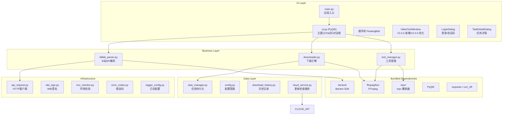
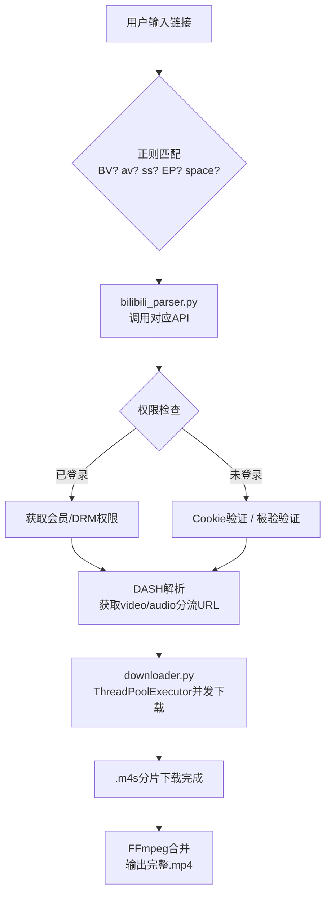
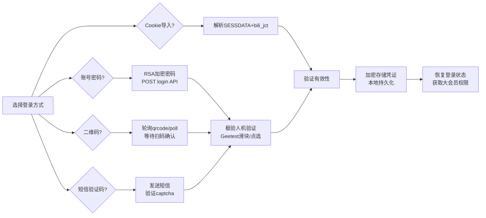
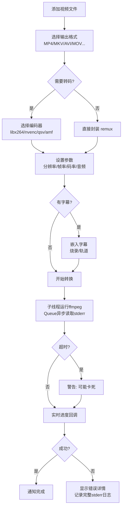

<div align="center">


# B站视频解析下载工具

一款功能强大的B站视频解析与下载工具，支持多种视频类型和下载模式，为用户提供便捷的视频内容获取体验。


<a href='http://www.bilidown.cn'></a>

**当前版本 V2.2.0**

**已获计算机软件著作权登记** · 登记号 `2026SR0955077`

</div>

---

## 软件著作权

本项目已取得中华人民共和国国家版权局签发的《计算机软件著作权登记证书》。

<a href="./assets/copyright/ruanzhu_certificate.png"></a>

| 项目 | 内容 |
| --- | --- |
| 软件名称 | B站视频解析工具 |
| 著作权人 | 吴浩楠 |
| 登记号 | 2026SR0955077 |
| 证书号 | 软著登字第18169358号 |
| 登记日期 | 2026年09月18日 |
| 权利取得方式 | 原始取得 |
| 权利范围 | 全部权利 |

软件著作权登记针对申请时提交的版本，后续迭代不影响已登记的著作权归属。

---

## 核心功能

### 视频解析与下载

| 能力 | 技术细节 |
|------|----------|
| **链接解析** | 正则匹配 BV号 / av号 / ss号 / EP号 / md号 / UP主空间地址，自动识别类型并路由到对应解析逻辑 |
| **视频类型** | 普通投稿 (ugc) / 番剧 (bangumi) / 合集 (season) / 课堂 (course) / 充电 (pay) / 课程 / Cheese 视频 |
| **清晰度选择** | 360P / 480P / 720P / 1080P+ / 1080P60 / 4K / HDR / Dolby Vision，根据视频实际提供的 DASH 流列表动态生成 |
| **DASH 解析** | 解析 B站 DASH 协议的音视频分片流，支持多 CDN 备选和自动切换 |
| **会员内容** | 通过 Cookie / OAuth 登录获取大会员权限，支持下载付费番剧、课程等受限内容 |
| **并发下载** | 基于 `ThreadPoolExecutor` 的可配置并发模型，每个任务独立线程池，互不干扰 |
| **断点续传** | 基于临时文件大小检测 + HTTP Range 请求头实现分段续传，网络中断后自动恢复 |
| **音视频合并** | 内置 FFmpeg，下载完成后自动将分离的视频(.m4s)和音频(.m4s)合并为完整 MP4 |

### 编码与画质

| 能力 | 技术细节 |
|------|----------|
| **GPU 硬件编码** | NVIDIA NVENC (h264_nvenc) / AMD AMF (h264_amf) / Intel QSV (h264_qsv)，启动时自动探测可用 GPU 并回退到 CPU (libx264) |
| **编码格式** | H.264 (AVC) / HEVC (H.265) / AV1 / VP9 / MPEG-4，支持 B站返回的原生编码直出或转码输出 |
| **先下后合模式** | 批量场景下可选：1) 边下边合（传统模式）2) 全部下载完毕后统一合并（减少 FFmpeg 启动开销，提升批量效率） |
| **码率控制** | 自适应 ABR 目标码率（`source × 1.25`，最低 800kbps），CPU/GPU 统一策略；支持复制数据流模式（零转码直接封装） |
| **HDR 支持** | 自动识别 HDR10 / Dolby Vision 元数据，合并时保留色彩空间信息 |
| **未知编码处理** | 对无法识别的视频编码自动降级为 H.264 软解码再编码，避免花屏 |

### 视频工具 (Video Tool)

> V2.0.5 新增模块，V2.0.6 优化关闭稳定性与下拉菜单宽度

| 能力 | 技术细节 |
|------|----------|
| **编码转换** | AV1 (libaom-av1) / HEVC (libx265) -> H.264 (libx264)，解决部分播放器/剪辑软件不兼容新编码的问题 |
| **容器格式** | MP4 / MKV / AVI / MOV / FLV / WebM 容器互转 |
| **分辨率缩放** | `-vf scale=W:H:force_original_aspect_ratio=decrease`，支持指定目标分辨率或按比例缩放 |
| **帧率转换** | `-r N` 参数，支持 24/30/60/120/144 等常见帧率插帧或抽帧 |
| **音频编码** | AAC / MP3 / FLAC / OPUS / WAV / AC3，支持采样率 (8K~48KHz) 和声道 (单声道/立体声) 调节 |
| **比特率控制** | 视频码率和音频码率独立可调 |
| **字幕嵌入** | 支持外挂 SRT/ASS 字幕烧录进视频画面 (`-vf subtitles=`) 或作为独立轨道封装 (`-c:s mov_text`) |
| **元数据写入** | 自定义 title / artist / comment 等 MP4 metadata |
| **硬件加速转换** | 转换过程同样支持 NVENC/QSV GPU 加速，大幅缩短转码时间 |
| **非阻塞 I/O** | 子线程读取 FFmpeg stderr 输出 + Queue 异步通信，UI 不卡顿；超时检测机制防止进程假死 |

### 直播解析

| 能力 | 技术细节 |
|------|----------|
| **他人直播回放** | 支持通过 UID、space 主页链接、直播间号获取主播直播回放列表 |
| **Cookie 同步** | 主程序登录态自动同步到直播解析模块，避免重复登录 |
| **回放下载** | 支持直播回放视频下载，音视频独立下载或合并下载 |

### 登录系统

| 方式 | 技术细节 |
|------|----------|
| **账号密码登录** | POST `https://passport.bilibili.com/web/v2/passport/login`，密码经 RSA 公钥加密传输 |
| **二维码登录** | 轮询 `https://passport.bilibili.com/x/passport-login/oauth2/qrcode/poll` 检测扫码状态 |
| **短信验证码登录** | 发送验证码至绑定手机号，通过 `captcha` 验证后完成登录 |
| **Cookie 导入** | 直接粘贴浏览器 Cookie 字符串，程序解析 SESSDATA 和 bili_jct 并验证有效性 |
| **极验人机验证** | 内置 [Geetest](https://www.geetest.com/) 验证码处理模块，自动完成滑块/点选验证 |
| **登录态持久化** | 登录凭证加密存储于本地配置文件，重启后自动恢复登录状态 |

### 用户界面

| 组件 | 说明 |
|------|------|
| **主窗口** | Tab 式布局：视频解析 / 批量下载 / 综合下载 / 收藏夹 / 设置 / 关于 |
| **悬浮球 (Floating Ball)** | 全局置顶可拖动窗体，右键菜单快速访问：粘贴链接、打开主窗口、显示/隐藏 |
| **任务管理窗口** | 独立窗口展示所有任务队列，支持实时进度条、状态标签颜色区分（进行中/已完成/失败）、滚动位置保持 |
| **任务详情弹窗** | 展示单个任务的完整信息：标题、URL、保存路径、耗时、错误日志、已下载文件列表（支持搜索过滤） |
| **UP主主页解析** | 输入空间 URL -> 调用 `x/space/wbi/arc/search` API -> 卡片式作品列表 -> 多选/全选 -> 批量加入下载队列 |
| **收藏夹解析** | 读取账号收藏列表（含普通/课程/番剧/专栏），卡片化展示，支持搜索和批量操作 |
| **字幕解析** | 解析视频 AI 字幕，时间轴可视化展示字幕时间分布，支持点击/拖动跳转与导出 SRT（V2.1.6 新增） |
| **封面下载** | 从视频信息中提取 cover URL，支持单张或批量下载原图 |
| **综合下载 Tab** | 一站式面板：同时勾选视频 / 弹幕 / 封面 / 字幕，一次点击全部执行 |
| **通知系统** | 基于 `QSystemTrayIcon` 的桌面气泡通知，下载完成/失败/错误时弹出提醒 |
| **窗口层级管理** | 登录框 / 验证码框 / 下载窗口自动设为父窗口的模态子窗口，保证始终浮于主界面之上 |
| **DPI 自适应** | 全局 DPI 缩放策略，高分辨率屏幕下文字和控件不截断、不重叠 |

### 基础设施

| 能力 | 说明 |
|------|------|
| **CLI 模式** | GUI 初始化失败时自动降级为命令行界面 (`bilibilidownloadtool` 命令)，支持无头服务器环境使用 |
| **热更新 (实验性)** | 云端版本比对 -> 下载更新包 -> SHA256 校验 -> 替换文件 -> 重启程序，双轨策略（自建 API 优先 / GitHub Releases 回退） |
| **云端公告** | 从服务器拉取 JSON 格式公告，支持按版本号定向推送（仅特定版本可见），主界面顶部 Banner 展示 |
| **安装/卸载程序** | Windows 安装包（NSIS 风格向导），支持自定义安装路径、创建桌面快捷方式、开始菜单项、覆盖安装保留配置 |
| **WBI 签名** | 实现 B站 WBI (Web Token) 签名算法 `img_key` + `sub_key`，用于调用需要签名的内部 API |
| **代理支持** | 配置 HTTP/SOCKS5 代理，解决部分地区访问限制问题 |
| **日志系统** | 基于 Python `logging` 的分级日志框架，输出到文件和控制台，按日期轮转，便于问题排查 |

---

## 技术架构


```mermaid
graph TB
    subgraph UI_Layer["UI Layer"]
        MAIN["main.py<br/>应用入口"]
        UI["ui.py (PyQt5)<br/>主窗口/Tab页/对话框"]
        FLOAT["悬浮球 FloatingBall"]
        VIDEO_TOOL["VideoToolWindow<br/>V2.0.5 新增/V2.0.6 优化"]
        LOGIN["LoginDialog<br/>登录/验证码"]
        TASK_DETAIL["TaskDetailDialog<br/>任务详情"]
    end

    subgraph Business_Layer["Business Layer"]
        PARSER["bilibili_parser.py<br/>B站API解析"]
        DOWNLOADER["downloader.py<br/>下载引擎"]
        TOOL_MGR["tool_manager.py<br/>工具管理"]
    end

    subgraph Data_Layer["Data Layer"]
        TASK_MGR["task_manager.py<br/>任务持久化"]
        CONFIG["config.py<br/>配置管理"]
        HISTORY["download_history.py<br/>历史记录"]
        CLOUD["cloud_service.py<br/>更新检查服务"]
    end

    subgraph Infra_Layer["Infrastructure"]
        API_REQ["api_request.py<br/>HTTP客户端"]
        WBI["wbi_sign.py<br/>WBI签名"]
        ENV_CHK["env_checker.py<br/>环境检测"]
        ERROR["error_codes.py<br/>错误码"]
        LOGGER["logger_config.py<br/>日志配置"]
    end

    subgraph External["Bundled Dependencies"]
        FFMPEG["ffmpeg/bin/<br/>FFmpeg"]
        BENTO4["bento4/<br/>Bento4 SDK"]
        MPV["mpv/<br/>mpv 播放器"]
        PYQT5["PyQt5"]
        REQUESTS["requests / curl_cffi"]
    end

    MAIN --> UI
    UI --> PARSER
    UI --> DOWNLOADER
    UI --> TOOL_MGR
    DOWNLOADER --> TASK_MGR
    PARSER --> API_REQ
    PARSER --> BENTO4
    TOOL_MGR --> FFMPEG
    TOOL_MGR --> MPV
    DOWNLOADER --> FFMPEG
    CLOUD --> CLOUD_API
```

### 关键数据流


```mermaid
flowchart TD
    A["用户输入链接"] --> B{"正则匹配<br/>BV? av? ss? EP? space?"}
    B --> C["bilibili_parser.py<br/>调用对应API"]
    C --> D{"权限检查"}
    D -->|"已登录"| E["获取会员/DRM权限"]
    D -->|"未登录"| F["Cookie验证 / 极验验证"]
    E --> G["DASH解析<br/>获取video/audio分流URL"]
    F --> G
    G --> H["downloader.py<br/>ThreadPoolExecutor并发下载"]
    H --> I[".m4s分片下载完成"]
    I --> J["FFmpeg合并<br/>输出完整.mp4"]
```

### 登录流程


```mermaid
flowchart LR
    A["选择登录方式"] --> B{"账号密码?"}
    A --> C{"二维码?"}
    A --> D{"短信验证码?"}
    A --> E{"Cookie导入?"}

    B --> B1["RSA加密密码<br/>POST login API"]
    C --> C1["轮询qrcode/poll<br/>等待扫码确认"]
    D --> D1["发送短信<br/>验证captcha"]
    E --> E1["解析SESSDATA+bili_jct"]

    B1 --> F["极验人机验证<br/>Geetest滑块/点选"]
    C1 --> F
    D1 --> F
    E1 --> G["验证有效性"]
    F --> G

    G --> H["加密存储凭证<br/>本地持久化"]
    H --> I["恢复登录状态<br/>获取大会员权限"]
```

### 视频转换流程


```mermaid
flowchart TD
    A["添加视频文件"] --> B["选择输出格式<br/>MP4/MKV/AVI/MOV..."]
    B --> C{"需要转码?"}
    C -->|"是"| D["选择编码器<br/>libx264/nvenc/qsv/amf"]
    C -->|"否"| E["直接封装 remux"]
    D --> F["设置参数<br/>分辨率/帧率/码率/音频"]
    E --> F
    F --> G{"有字幕?"}
    G -->|"是"| H["嵌入字幕<br/>烧录/轨道"]
    G -->|"否"| I["开始转换"]
    H --> I
    I --> J["子线程运行ffmpeg<br/>Queue异步读取stderr"]
    J --> K{"超时?"}
    K -->|"是"| L["警告: 可能卡死"]
    K -->|"否"| M["实时进度回调"]
    L --> M
    M --> N{"成功?"}
    N -->|"是"| O["通知完成"]
    N -->|"否"| P["显示错误详情<br/>记录完整stderr日志"]
```

---

## 快速开始

### 从源码运行

```bash
git clone https://github.com/NANblogink/bilibilidownloadtool.git
cd bilibilidownloadtool

# 创建虚拟环境 (推荐)
python -m venv .venv
.venv\Scripts\activate  # Windows
# source .venv/bin/activate  # macOS/Linux

# 安装依赖
pip install PyQt5 requests curl_cffi orjson Pillow psutil qrcode cryptography pywin32

# 启动
python main.py
```

## 常见问题

<details>
<summary><b>下载的视频没有声音？</b></summary>

这是正常行为。B站的 DASH 流将视频画面和音频分离传输为两个独立的 `.m4s` 文件。程序会在两个文件都下载完成后，自动调用 FFmpeg 将其合并为一个完整的 MP4 文件。合并过程中你会看到进度条从下载阶段切换到合并阶段。
</details>

<details>
<summary><b>AV1 / HEVC 视频花屏或无法播放？</b></summary>

这是因为 AV1 (libdav1d) 和 HEVC (libx265) 是较新的编码格式，部分播放器和编辑软件尚未完全支持。

解决方案：
1. 使用程序内置的「视频工具」功能，选择 H.264 输出格式进行转码
2. 或在下载设置中选择 H.264 编码（注意：此选项受限于 B站实际返回的编码格式）
3. 程序在合并时会自动检测编码，对不兼容编码自动触发转码流程
</details>

<details>
<summary><b>GPU 加速怎么开启/关闭？</b></summary>

程序首次启动时会自动探测系统中可用的 GPU 加速器：
- **NVIDIA**: 需要 NVENC 驱动 (GTX 950+ / RTX 系列)
- **AMD**: 需要 AMF 驱动 (RX 400+ 系列)
- **Intel**: 需要 QSV 驱动 (6代UHD Graphics+)

如需手动切换，进入「设置」页面找到「GPU加速」选项。当 GPU 编码失败时，程序会自动回退到 CPU (libx264) 编码，确保稳定性。
</details>

<details>
<summary><b>下载速度很慢？</b></summary>

下载速度取决于**网络环境**和**电脑带宽**，与账号类型（大会员/普通账号）无关，B站 CDN 速率是统一的。

建议：
1. 使用有线网络，避开网络高峰期
2. 检查电脑带宽是否被其他程序占用
3. 可在设置中调整并发线程数
</details>

<details>
<summary><b>提示 "未找到 ffmpeg"？</b></summary>

仓库已内置 `ffmpeg/bin/`。若丢失，可重新获取：

1. 下载 [ffmpeg-8.1.2-1-x86_64.tar.xz](https://mirrors.aliyun.com/cygwin/x86_64/release/ffmpeg/ffmpeg-8.1.2-1-x86_64.tar.xz)
2. 解压得到 `.tar`，继续解压得到 `usr` 文件夹
3. 进入 `usr/bin`，里面有 `ffmpeg.exe`、`ffprobe.exe`、`ffplay.exe`
4. 放入仓库的 `ffmpeg/bin/`，或配置到系统 PATH
5. 也可在「设置」->「高级」中手动指定 FFmpeg 路径
</details>

<details>
<summary><b>Cookie 怎么获取？</b></summary>

视频教程：

[点击查看 B 站视频教程](https://www.bilibili.com/video/BV1pZNTzsEd2)

图文步骤：

1. 浏览器打开 [bilibili.com](https://www.bilibili.com) 并登录
2. 按 F12 打开开发者工具
3. 切换到 **Network** (网络) 标签
4. 刷新页面，点击任意请求
5. 在 Request Headers 中找到 `Cookie` 字段
6. 复制完整 Cookie 字符串到程序的 Cookie 输入框
7. 点击「验证并保存」

提示：Cookie 有效期通常为数周至数月，过期后需重新获取。
</details>

---

## 版本历史

### V2.2.0 -- 当前版本

新增：
- **软件著作权信息**：设置 - 关于我们新增「软件著作权」卡片，可查看登记证书
- **启动窗口模式设置**：设置 - 窗口设置新增「启动时最大化窗口」
- **番剧额外合集解析**：番剧页附带的额外合集现可完整解析，按合集分组展示并支持整组勾选
- **文件名添加UP主名**：下载设置新增该选项，多P与合集下载更易区分
- **UP主 / 合集文件夹**：下载设置新增「保存到UP主文件夹」与「创建合集文件夹」
- **收藏夹刷新方式**：可选手动或自动，默认手动
- **顶部栏实时状态**：标题栏显示界面帧率与网络上下行速度

优化：
- **界面整体调整**：统一视觉风格与字体层级，重排主要页面与对话框
- **窗口自适应**：降低最小高度，内容超长时整体滚动，修正宽屏布局
- **选择集数对话框**：卡片模式铺满整宽，列表模式封面加载失败自动重试
- **弹幕页**：新增弹幕预览列表与空状态提示
- **设置与关于页**：设置项布局调整，关于页合并操作入口
- **下载历史**：记录真实产物路径，可直接用视频工具打开

修复：
- **Cookie 过期导致无法获取 1080P**：过期后仍被判定为已登录，未启用试看取流，最高只能获取 360P
- **视频工具无法定位 ffmpeg 与 ffprobe**：未覆盖随程序分发的工具目录，导致转换无法启动
- **视频工具转换完成后被误判为失败**：进程退出码未被正确回收，并可能引发界面无响应
- **视频工具子进程输出未消费**：输出缓冲区写满会阻塞进程，导致转换中途卡死
- **番剧试看取流未覆盖已登录用户**：已登录用户打开会员专享集会直接取流失败
- **在收藏夹只选部分视频却下载整个合集**：未显式选集数时会下载合集全部内容
- **继续按钮重新触发整个任务**：失败或等待状态下会新建任务并重复下载已完成的集数
- **停止解析会清空结果**：取消解析时丢弃已解析内容，现保留已获取的结果
- **同一视频被反复下载**：短时间内重复提交会创建大量重复任务
- **微软商店版日志与设置被拒绝访问**：安装目录只读，现改存至用户可写目录
- **合集解析只剩第 1 个分 P**：带分 P 参数的合集链接被误缩为单个分 P
- **扫码登录时崩溃**：并发取码存在线程安全问题
- **登录界面输入框样式错乱**：内联样式覆盖全局规则，导致边框与背景失效
- **主窗口有时超出屏幕**：恢复窗口位置时未同时限制尺寸
- **程序图标在部分场景显示为空白**：图标查找缺少兜底路径
- **仅下载音频时文件名缺少标题**：标题缺失时未回落到视频标题
- **内存与文件大小预估放大**：部分接口的时长单位混用，导致预估数值偏大

### V2.1.9

优化：
- **程序体积减小**：内置工具采用无损压缩，安装包体积明显减小
- **界面微调**：优化部分窗口在不同屏幕尺寸和 DPI 下的显示

修复：
- **微软商店安装后首次打开界面无法点击**：现可正常显示并操作

### V2.1.8

新增：
- **充电专属时长标记**：仅可试看的选集会标注实际可获取的时长
- **窗口过矮折叠系统信息**：开发者工具窗口过小时将系统信息折叠为单行入口

优化：
- **界面自适应**：优化各窗口在不同屏幕尺寸与 DPI 下的表现，避免布局错位与遮挡

修复：
- **内存与文件大小预估放大**：部分接口的时长单位被误用
- **渐进式流时长校验**：流被截断时记录警告并用于上述时长标记

### V2.1.7

修复：
- **合集视频重复下载**：空间列表批量下载时，同一合集内每个选中视频都会被展开为整个合集，导致重复下载

### V2.1.6

新增：
- **字幕解析功能**：支持解析视频 AI 字幕，时间轴可视化展示，可点击跳转并导出 SRT 文件

修复：
- **封面缩略图比例**：统一采用 16:9 标准比例
- **字幕高亮闪烁**：优化高亮效果
- **时间轴指示线**：新增可拖动的当前位置指示线
- **窗口行为**：所有窗口取消置顶，改为正常窗口层级，弹窗支持边框调节大小

### V2.1.5

修复：
- **番剧解析报错**：解析番剧信息时抛出异常，导致番剧与课程内容无法解析
- **合集视频下载内容错误**：合集下载时使用了错误的分 P 序号，导致报错或下载到错误内容

### V2.1.4

新增：
- **单实例检测**：启动时检测是否已有实例运行，防止反复启动多个窗口
- **卡死检测与自动恢复**：主线程无响应时自动中断阻塞，不丢失下载进度

修复：
- **多 P 视频只能下载第 1 个**：选择全部分 P 时只下载第一个
- **选集窗口无法缩放**：现支持边缘缩放与拖拽移动

优化：
- **选集列表树形分组**：多 P 视频按视频分组展示，可一键勾选整个分 P 视频

### V2.1.3

修复：
- **orjson 兼容性**：部分机器上缺少必要接口导致请求崩溃，现自动回退标准 json
- **更新弹窗崩溃**：下载更新期间关闭弹窗后，后台线程回调已销毁的界面对象

### V2.1.2

修复：
- **并发解析崩溃**：多线程批量解析时缓存无锁并发读写导致崩溃
- **热更新包损坏**：下载完整性校验缺失，现校验字节数并在截断时回退浏览器下载

### V2.1.1

新增：
- **按时长排序功能**：视频列表支持按时长排序

修复：
- **合集中分 P 获取不到**：批量解析合集类视频时部分分 P 无法获取
- **ffmpeg 路径处理**：统一路径分隔符，避免混合斜杠导致崩溃
- **加密视频解密**：优化中文路径下的临时目录处理

优化：
- **收藏夹解析速度**：并发分页请求提升解析速度
- **批量下载性能**：进度回调节流，减少信号洪泛导致的界面卡顿
- **下载重试机制**：分片下载与普通下载均采用指数退避重试

### V2.1.0

新增：
- **DRM 加密视频支持**：支持下载带 DRM 保护的视频
- **批量下载优化**：支持超大批量任务，分批添加避免界面卡死
- **分片下载**：大文件分片下载与断点续传
- **证书自动安装**：数字签名证书自动安装，减少杀毒软件误报

优化：
- **打包结构优化**：主程序与卸载程序在根目录，依赖统一放入 `_internal/`
- **安装程序**：向导式安装程序，支持云端下载和内嵌包双模式

### V2.0.7

新增：
- **直播解析功能**：支持通过 UID、主页链接或直播间号获取直播回放列表
- **音视频独立下载**：支持单独下载画面、单独下载音频或音视频合并下载

优化：
- ffmpeg 缺失时提供镜像下载地址与解压说明

修复：
- 无法下载 Hi-Res 与 1080P 以上分辨率视频
- 获取他人直播回放时提示账号未登录
- 仅下载音频时提示下载失败

### V2.0.6

新增：
- **视频处理模式选择**：新增复制数据流与重新编码两种模式
- **自适应码率控制**：根据源视频码率自动计算目标码率，解决固定参数导致文件体积异常膨胀
- **音频质量自动选择**：默认使用最高可用音质，仅显示平台实际支持的音质项
- **分辨率去重**：每个清晰度等级只显示一项
- **无需登录即可获取 1080P**

优化：
- 关闭视频工具窗口时强制终止转换进程并等待子线程退出，修复关闭时卡死

修复：
- 重新编码模式下画质不如预期
- 重编码后文件体积翻倍但画质无提升

### V2.0.5

- **视频工具模块**：独立窗口，支持新编码转换为 H.264，解决兼容性问题
- **下载编码选择**：设置面板新增目标编码选项
- **非阻塞转换**：转换过程异步读取输出，界面不卡死，并增加超时检测
- GPU 合并模式下码率异常下降
- 综合下载页多项问题
- 保存路径同步失效及无法修改默认下载路径
- 分 P 视频只有第一集显示标题
- 已完成任务在详情弹窗中错误显示为警告样式
- 「从历史选取」找不到已存在的历史文件
- 视频转换过程中的界面线程安全问题

### V2.0.4

- GPU 硬件加速：NVENC / AMF / QSV 自动探测与回退
- 先下载后合并批量模式：减少进程频繁启停的开销
- 窗口层级优化：登录与下载窗口强制置顶
- 窗口最小尺寸限制：防止过小导致布局错位
- 合并策略优化：GPU 编码失败自动降级 CPU

### V2.0.3

- 综合下载页：视频、弹幕、封面、字幕一站式面板
- 命令行工具：界面不可用时自动降级
- HEVC/AV1 花屏修复
- 收藏夹空内容与课程番剧不显示等多项修复

### V2.0.1

- 封面下载：收藏夹卡片一键或批量下载封面图
- 收藏夹界面重构：卡片式布局与搜索优化
- DPI 缩放适配改进

---

## 法律声明与免责条款

### 重要提示

**本项目仅供学习研究和技术交流目的使用。**

在使用本工具前，请务必仔细阅读以下条款：

#### 1. 使用范围限制

- 本工具仅允许用于**个人学习、研究和技术交流**
- **严禁**用于任何形式的商业用途、二次分发或盈利活动
- **禁止**利用本工具大规模爬取或批量下载 B站内容
- **禁止**将下载的内容用于侵犯原著作权的行为

#### 2. 版权合规要求

- 下载的视频内容版权归原作者及 B站所有
- 用户应尊重视频创作者的知识产权
- 下载后的内容不得用于：
  - 二次上传至其他平台
  - 商业传播或牟利
  - 任何侵犯原作者合法权益的行为
- 会员/付费内容的下载可能违反 B站 服务条款，由此产生的风险由使用者自行承担

#### 3. 合法使用说明

- 本工具基于公开的网络协议和标准接口开发，不包含任何破解、逆向工程或绕过安全机制的功能
- 本工具仅对用户已拥有合法访问权限的内容进行本地化处理和格式转换
- 用户应当确保自己拥有所访问和下载内容的合法权限（如大会员订阅等）
- **使用者应当自行评估使用行为的合法性，并对自己的行为负完全责任**

#### 4. 法律依据（合理使用）

本项目的设计与使用符合《中华人民共和国著作权法》关于"合理使用"的相关规定：

> **《中华人民共和国著作权法》（2020年修正）第二十四条**
>
> 在下列情况下使用作品，可以不经著作权人许可，不向其支付报酬，但应当指明作者姓名或者名称、作品名称，并且不得影响该作品的正常使用，也不得不合理地损害著作权人的合法利益：
>
> （一）为个人学习、研究或者欣赏，使用他人已经发表的作品；
>
> （二）为介绍、评论某一作品或者说明某一问题，在作品中适当引用他人已经发表的作品；
>
> ...
>
> **前款规定适用于对与著作权有关的权利的限制。**

**法律解读：**

1. **个人学习研究例外**：根据著作权法第24条第1项，用户为个人学习、研究或欣赏目的下载并观看视频内容，属于法定"合理使用"情形，无需获得著作权人许可。

2. **技术工具中立性**：本工具本身仅提供技术能力，类似于浏览器、播放器等通用软件。工具的使用方式由用户自主决定，开发者不对用户的最终用途承担责任。

3. **已发表作品**：B站平台上的视频均为公开传播的"已发表作品"，符合合理使用的前提条件。

4. **不损害正常使用**：个人下载观看行为不会替代或影响原平台的正常运营和商业模式，不构成对著作权的实质性侵害。

5. **格式转换的合法性**：将视频从一种编码格式转换为另一种格式以适配本地播放设备，属于技术兼容性处理，在合理范围内受法律保护。

#### 5. 免责声明

- 作者开发本工具的初衷是**技术研究和个人学习**
- **作者不对因使用本工具造成的任何后果承担责任**，包括但不限于：
  - 账号被封禁或限制
  - 法律纠纷或诉讼
  - 设备损坏或数据丢失
  - 第三方索赔
- 使用本工具即表示您已充分理解上述风险并同意自行承担

#### 6. 反馈与举报

- 如发现任何技术缺陷或有功能的改进建议，欢迎通过 Issues 提出
- 如发现本工具被滥用，请联系作者进行处理

---

## 联系我们

| 渠道 | 信息 |
|------|------|
| **官网** | [www.bilidown.cn](http://www.bilidown.cn) |
| **作者** | 寒烟似雪 & 逸雨 |
| **QQ 交流群** | [714822491](https://jq.qq.com/?_wv=1027&k=714822491) |
| **B站主页** | [不会玩python的man](https://space.bilibili.com/3546841002019157) |
| **GitHub Issues** | [提交 Issue](https://github.com/NANblogink/bilibilidownloadtool/issues) |

<div align="center">

如果这个工具对你有帮助，欢迎给一个 Star 支持持续开发！

</div>
